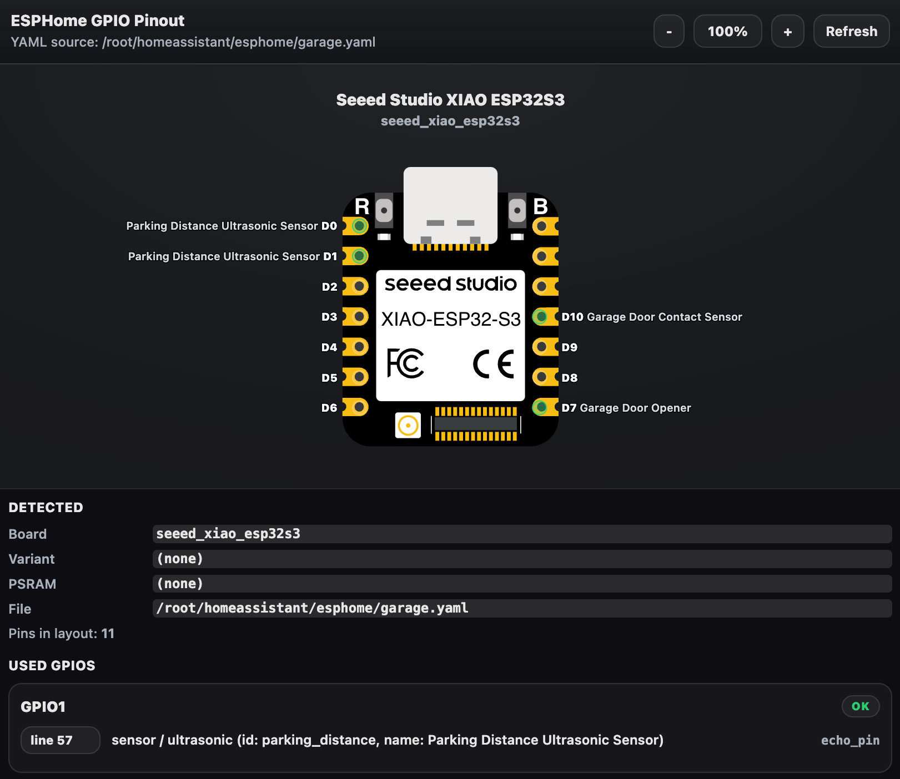

# ESPHome GPIO Pinout

[](https://marketplace.visualstudio.com/items?itemName=mikeharty.esphome-gpio-pinout)
[](https://marketplace.visualstudio.com/items?itemName=mikeharty.esphome-gpio-pinout)
[](https://marketplace.visualstudio.com/items?itemName=mikeharty.esphome-gpio-pinout)
[](LICENSE)



This extension adds a GPIO pinout overlay for ESPHome board GPIO pins. It inspects the active ESPHome YAML file, detects used GPIO pins, and renders a board pinout. Warnings are displayed for pins used in the YAML that are problematic or not available on the selected board.

## Usage

1. Open an ESPHome YAML file in VS Code (language mode must be YAML).
2. Open the pinout pane using any of these:
   - Editor title button: **GPIO Pinout** (YAML editors)
   - Command palette: **ESPHome: GPIO Pinout**
3. Optional: enable automatic opening for ESPHome-like YAML files:
   - Setting: `esphomeGpioPinout.autoOpen`
   - Default: `false`
4. Click a pin or line button to jump to the YAML location.
5. Use the zoom controls to scale the diagram.

The extension currently detects ESPHome board blocks for `esp32`, `esp8266`, `rp2040`, and `nrf52`.

## Development

See [DEVELOPMENT.md](DEVELOPMENT.md) for setup, debugging, testing, and packaging details.

## Pinout Data Sources

Pinout data is generated from locked upstream commits and committed into this repo:

- PlatformIO board manifests (`platform-espressif32`, `platform-espressif8266`) for board ID scope and SoC mapping.
- Wokwi custom board definitions (`board.json` + `board.svg`) for SVG-backed board layouts.
- Adafruit WipperSnapper board definitions for matched board GPIO subsets when no Wokwi layout exists.
- Built-in SoC rule tables for chip-level warnings and fallback rendering.

Update and verify data with:

```sh
npm run pinouts:update
npm run pinouts:build
npm run pinouts:check
```

## Notes

- The extension reads from the active editor, including unsaved changes, and auto-refreshes on file save.
- Board coverage now includes all ESPHome-relevant PlatformIO IDs for ESP32 + ESP8266, plus requested nRF52/RP2040 boards, with SoC fallback when full board artwork is unavailable.
- The extension uses a simple YAML parser and may not handle all ESPHome YAML constructs. Please file an issue if you encounter problems.
- Feedback and contributions are welcome!

## Thanks

Thanks to the projects that provide the board and pinout source data used by this extension:

- [wokwi/wokwi-boards](https://github.com/wokwi/wokwi-boards)
- [platformio/platform-espressif32](https://github.com/platformio/platform-espressif32)
- [platformio/platform-espressif8266](https://github.com/platformio/platform-espressif8266)
- [adafruit/Wippersnapper_Boards](https://github.com/adafruit/Wippersnapper_Boards)
