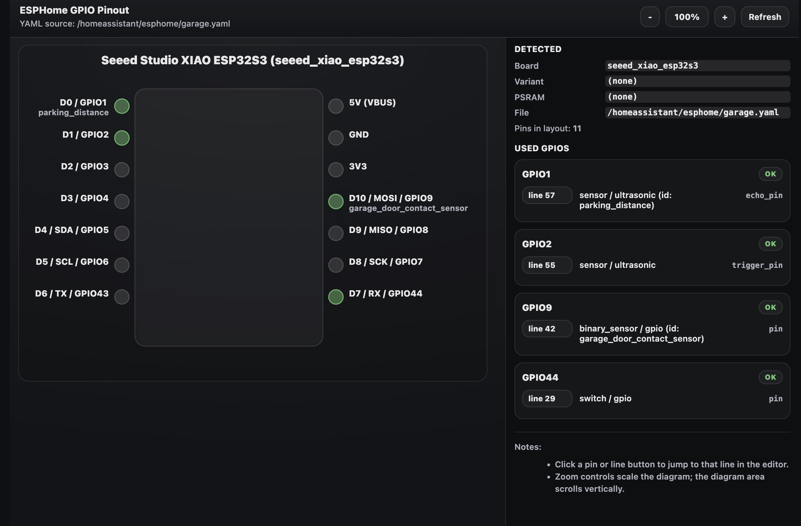

# ESPHome GPIO Pinout

This extension adds a GPIO pinout overlay for ESPHome board GPIO pins. It inspects the active ESPHome YAML file, detects used GPIO pins, and renders a board pinout. Warnings are displayed for pins used in the YAML that are problematic or not available on the selected board.

## Usage

1. Open an ESPHome YAML file in VS Code (language mode must be YAML).
2. From the command palette, run: **ESPHome: GPIO Pinout**.
3. Click a pin or line button to jump to the YAML location.
4. Use the zoom controls to scale the diagram.

## Development

See [DEVELOPMENT.md](DEVELOPMENT.md) for setup, debugging, testing, and packaging details.

## Notes

- The extension reads from the active editor, including unsaved changes, and auto-refreshes on file save.
- Pin mappings are currently hard-coded and limited to a small handful of ESP32 boards I have on hand, but new mappings can easily be added. See [CONTRIBUTING.md](CONTRIBUTING.md) for details.
- The extension uses a simple YAML parser and may not handle all ESPHome YAML constructs. Please file an issue if you encounter problems.
- Feedback and contributions are welcome!
